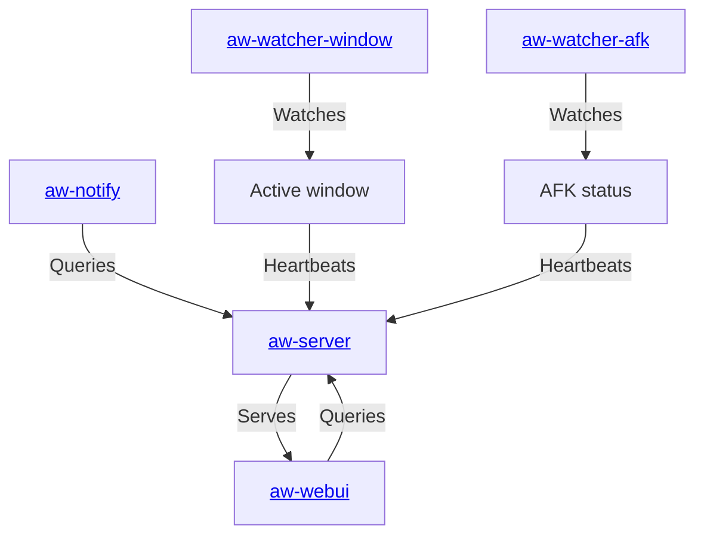

# Chronly

**This is Chronly, a private fork of [ActivityWatch](https://activitywatch.net/),
maintained by Manuel Arroyo Algar. Not affiliated with or endorsed by the
ActivityWatch project.** Licensed under MPLv2, same as upstream — see
[docs.activitywatch.net/en/latest/forking.html](https://docs.activitywatch.net/en/latest/forking.html)
for what that means. Every submodule this fork actually uses (aw-core,
aw-client, aw-server and its aw-webui, aw-watcher-afk, aw-watcher-window,
aw-notify) is retargeted to this account's own forks. Unused upstream
components (the aw-qt tray app, aw-server-rust, aw-watcher-input, aw-tauri,
awatcher) were removed rather than carried along.

<p align="center">
  <b>Records what you do</b> so that you can <i>know how you've spent your time</i>.
  <br>
  All in a secure way where <i>you control the data</i>.
</p>

## About

The goal is simple: *enable the collection of as much valuable lifedata as possible without compromising user privacy.*

This works by storing all data locally on your own machine, with a set of watchers that record things like:

 - Currently active application and the title of its window
 - Currently active browser tab and its title and URL
 - Keyboard and mouse activity, to detect if you are AFK ("away from keyboard") or not

## Installation & Usage

Chronly is a single Docker container (aw-server + the built web UI). Pull the published
image — no source access needed:

```bash
docker run -d --name chronly -p 5600:5600 -v chronly-data:/data ghcr.io/ironcatan/chronly:latest
```

Then open `http://localhost:5600/`. Data persists in the `chronly-data` volume across restarts/upgrades.

To upgrade later: `docker pull ghcr.io/ironcatan/chronly:latest`, then recreate the container.

Optional native pieces (not required to use the web UI): `aw-watcher-afk` and
`aw-watcher-window` for automatic activity tracking, and `aw-notify` for desktop
notifications/alerts. These run as regular background processes on your machine and
require building from source (their code isn't publicly published) — see
[About this repository](#about-this-repository) below.

## Architecture



## About this repository

This repo bundles the components used by this instance (managed with `git submodule`).

### Server

`aw-server` (Python) provides a REST API to a datastore and query engine, and serves the web
interface (`aw-webui`). The REST API includes:

 - **Buckets API:** Create, retrieve, and delete data buckets
 - **Events API:** Read and write timestamped events within buckets
 - **Heartbeat API:** Watchers use heartbeat signals to update the current state of activity
 - **Query API:** simple query scripting language for filtering, merging, grouping, and transforming events
 - This fork adds: **Purge API** (bulk-delete events before a date) and a **storage-size** endpoint

The frontend (`aw-webui`, translated to Spanish in this fork) includes dashboard/timeline views,
a query explorer, an activity browser, and export/backup/restore/purge tooling under
Ajustes → Gestión de datos.

### Watchers

 - `aw-watcher-afk` tracks the user active/inactive state from keyboard and mouse input
 - `aw-watcher-window` tracks the currently active application and its window title

Both are forked for independence but unmodified (aw-watcher-window has one small
fix for a macOS sandboxing edge case). A full list of the wider watcher ecosystem
is in [ActivityWatch's documentation](https://docs.activitywatch.net/en/latest/watchers.html).

### Libraries

 - `aw-core` - core library, provides no runnable modules
 - `aw-client` - client library, useful when writing watchers

### Source access

All source repos (`aw-core`, `aw-client`, `aw-server`, `aw-webui`,
`aw-watcher-afk`, `aw-watcher-window`, `aw-notify`) and this one are public —
see the [Architecture](#architecture) links above, or browse this repo's
submodules directly.

## Releasing a new version

`VERSION` (at repo root) tracks the Chronly release/image version — it's
independent from `aw-server`'s own internal API version (the `v0.13.x` shown
under Settings), which isn't bumped by this fork. Every time a change goes to
production:

1. Bump `VERSION` (semver) and commit it.
2. Tag the commit: `git tag vX.Y.Z && git push myfork vX.Y.Z` (add `--tags` to
   push, once you're ready to push commits too).
3. Build and tag the image with both the version and `latest`:
   ```bash
   docker compose build
   docker tag activitywatch-activitywatch:latest ghcr.io/ironcatan/chronly:vX.Y.Z
   docker tag activitywatch-activitywatch:latest ghcr.io/ironcatan/chronly:latest
   docker push ghcr.io/ironcatan/chronly:vX.Y.Z
   docker push ghcr.io/ironcatan/chronly:latest
   ```

This keeps `latest` reproducible — anyone can pin to `vX.Y.Z` instead, and a
past version can always be pulled back if a release has a problem.
