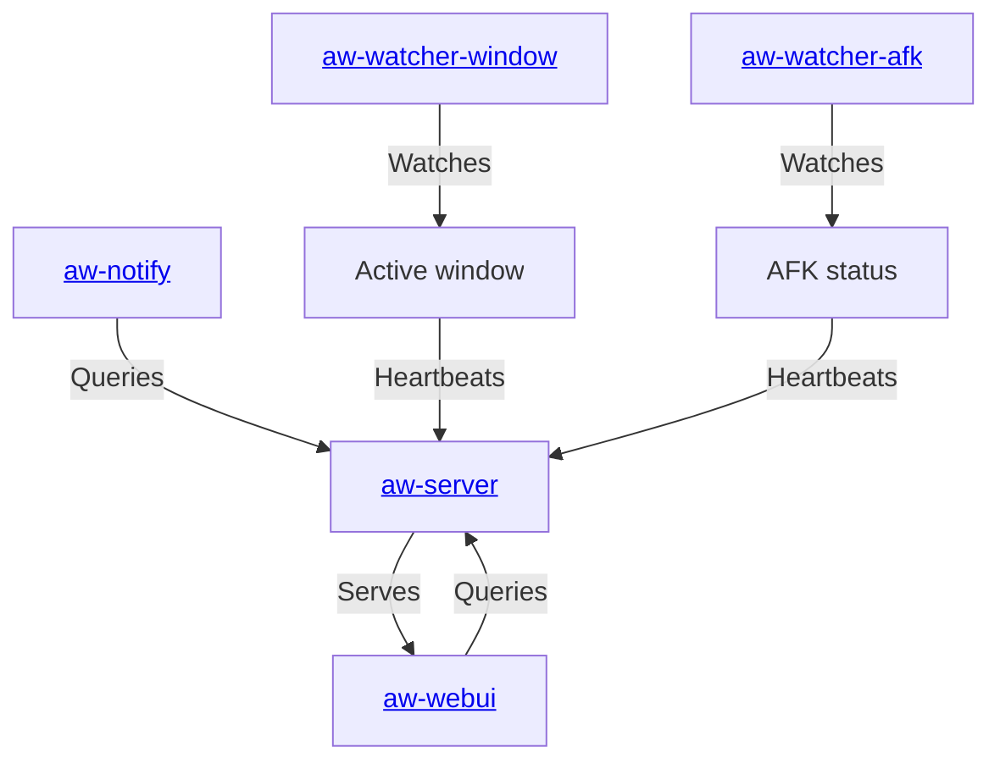

# Chronly

**This is Chronly, a private fork of [ActivityWatch](https://activitywatch.net/),
maintained by Manuel Arroyo Algar. Not affiliated with or endorsed by the
ActivityWatch project.** Licensed under MPLv2, same as upstream — see
[docs.activitywatch.net/en/latest/forking.html](https://docs.activitywatch.net/en/latest/forking.html)
for what that means. Submodules for aw-core, aw-server (and its aw-webui),
and aw-notify are retargeted to this account's own forks; everything else
still tracks the official ActivityWatch repos.

<p align="center">
  <b>Records what you do</b> so that you can <i>know how you've spent your time</i>.
  <br>
  All in a secure way where <i>you control the data</i>.
</p>

## About

The goal is simple: *enable the collection of as much valuable lifedata as possible without compromising user privacy.*

This works by storing all data locally on your own machine, with a set of watchers that record things like:

 - Currently active application and the title of its window
 - Currently active browser tab and its title and URL
 - Keyboard and mouse activity, to detect if you are AFK ("away from keyboard") or not

## Installation & Usage

This fork is deployed as a single Docker container (aw-server + the built web UI):

```bash
git clone --recurse-submodules https://github.com/ironcatan/chronly-docker.git chronly
cd chronly
docker compose up -d --build
```

Then open `http://localhost:5600/`.

Optional native pieces (not required to use the web UI): `aw-watcher-afk` and
`aw-watcher-window` for automatic activity tracking, and `aw-notify` for desktop
notifications/alerts. These run as regular background processes on your machine
(see each submodule's own README) — there's no installer/release build for them.

## Architecture



## About this repository

This repo bundles the components used by this instance (managed with `git submodule`).

### Server

`aw-server` (Python) provides a REST API to a datastore and query engine, and serves the web
interface (`aw-webui`). The REST API includes:

 - **Buckets API:** Create, retrieve, and delete data buckets
 - **Events API:** Read and write timestamped events within buckets
 - **Heartbeat API:** Watchers use heartbeat signals to update the current state of activity
 - **Query API:** simple query scripting language for filtering, merging, grouping, and transforming events
 - This fork adds: **Purge API** (bulk-delete events before a date) and a **storage-size** endpoint

The frontend (`aw-webui`, translated to Spanish in this fork) includes dashboard/timeline views,
a query explorer, an activity browser, and export/backup/restore/purge tooling under
Ajustes → Gestión de datos.

### Watchers

 - `aw-watcher-afk` tracks the user active/inactive state from keyboard and mouse input
 - `aw-watcher-window` tracks the currently active application and its window title

Both still track upstream ActivityWatch (unmodified in this fork). A full list of the wider
watcher ecosystem is in [ActivityWatch's documentation](https://docs.activitywatch.net/en/latest/watchers.html).

### Libraries

 - `aw-core` - core library, provides no runnable modules
 - `aw-client` - client library, useful when writing watchers
